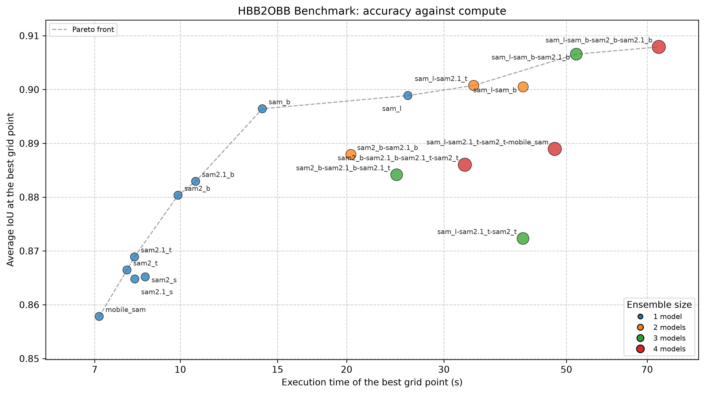
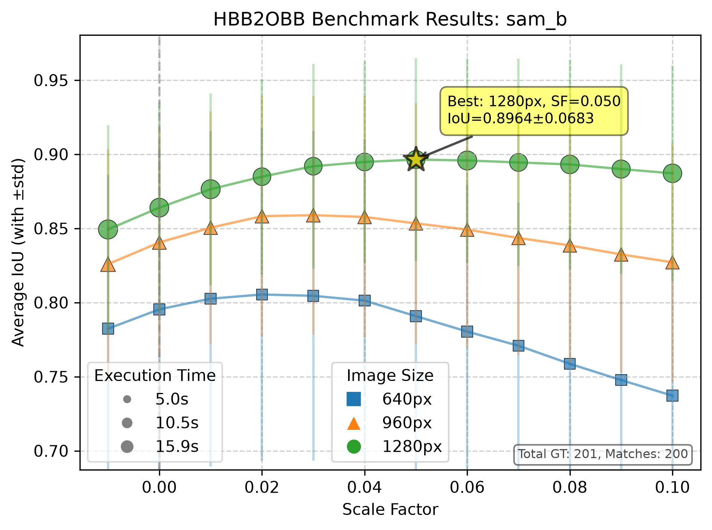

# Sample Data

This directory contains sample data for demonstrating and testing the HBB2OBB toolkit functionality. The data includes images, horizontal bounding box (HBB) annotations, ground truth oriented bounding box (OBB) annotations, and automatically converted OBB annotations.

Everything here except the four inputs listed below is produced by the tools in this repository, and the [Reproducing This Folder](#reproducing-this-folder) section gives the exact command for each artifact, in order.

## Data Attribution

The sample images provided in the `images` folder are sourced from the [Songdo Vision](https://doi.org/10.5281/zenodo.13828407) dataset and are re-used here under the Creative Commons Attribution 4.0 International (CC-BY-4.0) license.

> **These three frames are part of the Songdo Vision test split.** `00164.jpg`, `04433.jpg` and `05050.jpg` are byte-identical to the images of the same name in the `test` subset of Songdo Vision (verified by MD5). They are fine as a demonstration and regression fixture, which is all they are here for, but any accuracy number measured on them is measured on test data. Do not tune or benchmark on this folder and then report the result against Songdo Vision or Songdo Vision OBB.

### Original Dataset Details:
- **DOI:** [10.5281/zenodo.13828407](https://doi.org/10.5281/zenodo.13828407) (concept DOI, resolves to the latest version)
- **Title:** *Songdo Vision: Vehicle Annotations from High-Altitude BeV Drone Imagery in a Smart City*
- **Authors:** Robert Fonod, Haechan Cho, Hwasoo Yeo, Nikolas Geroliminis
- **Publisher:** Zenodo
- **License:** [CC-BY-4.0](https://creativecommons.org/licenses/by/4.0/deed.en)

Only the images were taken from there. The horizontal boxes in this folder come from the [Geo-trax](https://github.com/rfonod/geo-trax) detector, as step 1 below shows.

## What Is Input, What Is Generated

Four things are inputs. Nothing in this repository can regenerate them:

| Input | What it is |
| :--- | :--- |
| `images/*.jpg` | 3 drone frames from Songdo Vision |
| `labels_obb_gt/*.txt` | the ground truth oriented boxes, YOLO TXT, absolute px, drawn by hand |
| `classes.yaml` | the label map, class id to name |
| `benchmark.yaml` | the hyperparameter sweeps behind `benchmark_results/` |

Everything else is generated from those, in one of four ways: `hbb2obb-detect` finds the horizontal boxes, `hbb2obb` converts them into OBBs, `hbb2obb-convert` derives the other annotation formats from the canonical YOLO TXT files, and `hbb2obb-optimize` produces the benchmark folders. The ground truth is the only annotation here that a person drew, which is what makes it usable to measure the rest against.

```
data/
├── images/                        # INPUT     sample drone imagery
├── classes.yaml                   # INPUT     label map, class id to name
├── benchmark.yaml                 # INPUT     the sweeps behind benchmark_results/
│
├── labels_hbb/                    # Horizontal boxes, detected
│   ├── <frame>.txt                #   output  YOLO HBB + confidence, absolute px (canonical)
│   └── <frame>.xml                #   derived Pascal VOC
├── coco_annotations_hbb.json      #   derived COCO, the same horizontal boxes
│
├── labels_obb_gt/                 # Ground truth oriented boxes
│   ├── <frame>.txt                #   INPUT   YOLO OBB, absolute px (canonical)
│   └── <frame>.dota               #   derived DOTA
├── coco_annotations_obb_gt.json   #   derived COCO, the same oriented boxes
│
├── labels_obb/                    # OBBs converted from the HBBs by hbb2obb
│   ├── <frame>.txt                #   output  YOLO OBB + confidence (canonical)
│   ├── <frame>.dota               #   derived DOTA
│   └── <frame>.jpg                #   output  --save_img visualization
├── coco_annotations_obb.json      #   derived COCO, the same converted boxes
├── labels_polygon/<frame>.txt     # output    --save_polygon segmentation contours
│
└── benchmark_results/             # output    one sweep per SAM combination, plus what reads them together
    ├── summary.md                 #   every run in one table, and the winner
    ├── comparison.png             #   best IoU against execution time, one point per run
    ├── PROVENANCE.txt             #   source, checkpoint and input hashes, versions, the command
    ├── benchmark.yaml             #   a copy of the config, so the folder re-runs on its own
    └── <name>/                    #   one sweep
        ├── run_config.yaml        #     the resolved settings and the host it ran on
        ├── results.yaml           #     the full grid of results
        ├── summary.txt            #     human-readable summary
        └── plot.png               #     rendered from results.yaml
```

### Annotation Details

- **labels_hbb**: the horizontal boxes a detector found in the images, with its confidence in the 6th column. Nothing here was drawn or corrected by hand, so the folder reproduces exactly, and what the conversion consumes is what a detector actually produces.
- **labels_obb_gt**: manually annotated OBBs, serving as ground truth for evaluation and parameter tuning.
- **labels_obb**: OBBs produced from `labels_hbb` by `hbb2obb`, with a per-box confidence in the 10th column. It is the `combined` score, the conversion quality times the detector confidence carried over from `labels_hbb`.

All three sets ship in three formats apiece, so the tooling has something to work against out of the box. The YOLO TXT file is canonical in each case and the others are one common rounding of it, which is why every derived format below is written **from the `.txt`** (`-f yolo`) rather than from another derived file.

Unlike the 50-frame tuning set released with Songdo Vision OBB, the HBBs here are **not** the axis-aligned envelopes of the ground-truth OBBs, and the two sets are not row-aligned: one is detected, the other drawn by hand, and neither was derived from the other. They also do not describe quite the same objects, which is what step 5 measures.

## Reproducing This Folder

Run everything from the repository root. Weights are resolved relative to the working directory, so `models/` is read from and written to there.

### 1. Detect the horizontal boxes

```bash
hbb2obb-detect data/images -mp data/classes.yaml   # add --overwrite to replace an existing set
```

```
Wrote 201 boxes over 3 frames to data/labels_hbb
  0 Car: 186
  1 Bus: 6
  2 Truck: 8
  3 Motorcycle: 1
```

This writes `labels_hbb/<frame>.txt`, the boxes and the detector's confidence in the 6th column. It uses the default detector, [Geo-trax](https://github.com/rfonod/geo-trax), whose [weights](https://huggingface.co/rfonod/geo-trax) are downloaded to `models/` on first use, at the resolution and over the four vehicle classes it was validated on. Nothing here is hand-drawn or hand-corrected: this is what the detector produces, which is what the rest of the folder is then built from.

Detection is not perfect, and the folder does not pretend otherwise. Against the hand-drawn ground truth of step 5, the detector misses one motorcycle in `00164` (a scooter with its rider; motorcycles are its weakest class) and finds one car the annotator left out, cut off by the right edge of the frame and half hidden by a tree. That is why step 5 reports one unmatched box on each side, and it is the honest shape of a real conversion run.

> If you have hand-drawn boxes of your own, `--merge_with` keeps their geometry untouched and only attaches the confidence of the detection covering each one, so you gain the confidence column without losing your corrections. See the main README.

### 2. Convert the HBBs into OBBs

```bash
hbb2obb data/images --save_img --save_confidence --save_polygon --confidence_source combined
```

This writes `labels_obb/<frame>.txt` (with the confidence column), the `--save_img` overlays beside them, and `labels_polygon/<frame>.txt`. It uses the defaults otherwise: a single `sam_b` model, `--imgsz 1280`, `--scale_factors 0.05`, `--opening_kernel_percentage 0.15`. Better results are available from a model ensemble and tuned hyperparameters, as described in the main README.

`--confidence_source combined` makes each score the conversion quality times the detector confidence from step 1, so one number answers both questions at once: is there really an object here, and did the OBB fit it well. Drop the flag for the default `conversion` score alone, or pass `detector` for the input confidence alone; all three work on this data because step 1 wrote that 6th column.

> Expect the geometry to reproduce to within about a pixel rather than exactly. SAM inference is not bit-reproducible across `torch` builds and hardware; re-running the command above moves a box or two by 1 px.

### 3. Derive the other formats

Each canonical YOLO TXT set is converted to DOTA or Pascal VOC beside itself, and to one COCO file at the top level:

```bash
# the converted OBBs
hbb2obb-convert data/labels_obb    -f yolo --to dota -o data/labels_obb    -mp data/classes.yaml --images data/images
hbb2obb-convert data/labels_obb    -f yolo --to coco -o data               -mp data/classes.yaml --images data/images

# the ground truth OBBs
hbb2obb-convert data/labels_obb_gt -f yolo --to dota -o data/labels_obb_gt -mp data/classes.yaml --images data/images
hbb2obb-convert data/labels_obb_gt -f yolo --to coco -o data               -mp data/classes.yaml --images data/images \
                                   --coco_name coco_annotations_obb_gt.json

# the horizontal boxes
hbb2obb-convert data/labels_hbb    -f yolo --to voc  -o data/labels_hbb    -mp data/classes.yaml --images data/images
hbb2obb-convert data/labels_hbb    -f yolo --to coco -o data               -mp data/classes.yaml --images data/images
```

`--coco_name` is needed only for the ground truth: a COCO file is named `coco_annotations_<kind>.json` by default, which already matches `labels_obb` and `labels_hbb`, but the ground truth directory is `labels_obb_gt`. That pairing is what `--verify` follows.

Confidence survives into COCO as a `score` field, so this renders exactly the same picture as the YOLO files do:

```bash
hbb2obb-view data/images --obb_dir data/coco_annotations_obb.json --show_confidence
```

The same is true of the horizontal boxes: `coco_annotations_hbb.json` carries the detector confidence from step 1 in its `score` fields. DOTA and Pascal VOC have no slot for a confidence and drop it, so `labels_hbb/*.xml` holds the geometry alone.

### 4. Check that every format agrees

```bash
hbb2obb-convert data --verify -mp data/classes.yaml
```

```
labels_hbb: 3 frames, 201 boxes, 3 formats (coco, voc, yolo)
labels_obb: 3 frames, 201 boxes, 3 formats (coco, dota, yolo)
labels_obb_gt: 3 frames, 201 boxes, 3 formats (coco, dota, yolo)
OK: 603 boxes, every format encodes the same boxes
```

This compares by exact equality after rounding, not by a tolerance, so it fails on a single misplaced pixel.

### 5. Evaluate the conversion against the ground truth

```bash
hbb2obb-eval data/labels_obb_gt data/labels_obb
```

```
=== Overall Results ===
Evaluation Mode: Class-Specific (matches only boxes with same class label)
Total Ground Truth Boxes: 201
Total Predicted/Converted Boxes: 201
Total Matched Boxes: 200
Total Unmatched GT Boxes: 1
Total Unmatched Pred Boxes: 1
Average IoU: 0.8964 ± 0.0683

=== Results by Class ===
Class  GT  Pred  Matches IoU (mean ± std)
    0 185   186      185  0.8982 ± 0.0606
    1   6     6        6  0.9358 ± 0.0353
    2   8     8        8  0.8533 ± 0.1469
    3   2     1        1  0.6746 ± 0.0000
```

The one unmatched box on each side is the pair from step 1: the motorcycle the detector missed has no converted box, and the edge-cut car it found has no ground truth box. Everything the detector did find converted, and matched. The evaluator ignores the trailing confidence column, so it reads the converted files as they are written in step 2. For more options, such as excluding specific classes, class-agnostic matching or a different IoU threshold, run `hbb2obb-eval --help`.

### 6. Regenerate the benchmark folders

Every sweep in `benchmark_results/` is described by [`benchmark.yaml`](benchmark.yaml), so one command reproduces all of it:

```bash
hbb2obb-optimize -c data/benchmark.yaml --dry_run   # what it will do, and what it will cost
hbb2obb-optimize -c data/benchmark.yaml             # the whole thing
hbb2obb-optimize -c data/benchmark.yaml --refresh   # only redraw the plots and summary.md
```

Eighteen model combinations, each a full grid of 3 inference sizes x 12 scale factors x 1 opening kernel, so 36 SAM passes per combination and 648 in total. That took 2.92 hours on a laptop CPU; `--resume` skips the combinations already finished, which is what makes a longer run on your own data survivable. To sweep something else once, without touching the config:

```bash
hbb2obb-optimize data/images data/labels_obb_gt -sm sam_b -iz 960 1280 -sf 0.03 0.05 -n quick
```

Each grid point is converted into a temporary directory and scored there, so the sweep never touches `labels_obb/` from step 2.

## Looking at the Annotations

```bash
hbb2obb-view data/images                               # the converted OBBs over their source HBBs
hbb2obb-view data/images --show_confidence             # tinted green to red by score, value printed
hbb2obb-view data/images --compare data/labels_obb_gt  # ground truth overlaid in blue
hbb2obb-view data/images --obb_format dota             # read the DOTA files instead of the YOLO ones
```

`q` quits, the wheel zooms, dragging pans, `g` overlays the segmentation polygons from step 2. See the main README for the full key list.

## Benchmark Results

The `benchmark_results` directory holds the sweeps described in step 6, one subfolder per set of SAM models. They are shipped **for illustration**: to show what the optimizer produces and what its artifacts look like. They are measured against the boxes this folder ships, so step 6 reproduces them.

**[`benchmark_results/summary.md`](benchmark_results/summary.md) is the generated write-up:** every run's best grid point in one table, sorted by IoU, with the winner named and `comparison.png` showing accuracy against compute. [`benchmark_results/PROVENANCE.txt`](benchmark_results/PROVENANCE.txt) records the checkpoint hashes, the hashes of the label sets the numbers were measured against, a digest of the hbb2obb source that ran, the library versions and the command. Both are written by the same command that produces the runs, so neither can drift from them, and `benchmark.yaml` is copied in beside them so the folder re-runs without this repository.



`comparison.png`, shipped with this folder: each point is one model set at its best grid point, and the dashed line is the Pareto front (the runs no other run beats on both accuracy and time).

The nine ensembles are arranged as **three ladders**, each growing from two models to four by adding the next weaker one, so that reading across a ladder varies ensemble size at roughly fixed member quality and reading down the three ladders at one size varies quality at fixed size. What they say, all of it worth taking as a hypothesis to test on your own data rather than as a finding:

| Ladder | 2 models | 3 models | 4 models |
| :--- | ---: | ---: | ---: |
| Strong (`sam_l`, `sam_b`, then the SAM2 base pair) | 0.9005 | 0.9066 | **0.9079** |
| Mixed (`sam_l`, then tiny models) | 0.9008 | 0.8723 | 0.8890 |
| Light (SAM2 base pair, then the tiny ones) | 0.8879 | 0.8842 | 0.8860 |

**More models help only when the models you add are themselves strong.** The strong ladder rises at every step. Neither other ladder does, and the mixed one collapses at three before partly recovering at four. **Majority voting explains the shape:** a pair needs both members to agree, so it is an intersection and the large model holds a veto; three members need only two, so the two tiny models can outvote `sam_l` between them and drag the result down to roughly what they produce alone (0.8723 against their own 0.8665 and 0.8689); four members need three again, which is strict enough to recover part of the loss. Ensemble size is therefore not a dial that turns one way.

**The cheapest good configuration is a large model paired with a tiny one.** `sam_l sam2.1_t` reaches 0.9008 in 34 s, edging out `sam_l sam_b` (0.9005) in three quarters of the time, and both beat `sam_l` alone (0.8989). **1280 px wins all eighteen runs**, by a wide margin over 640 px. And **within SAM2 the small checkpoints buy nothing over the tiny ones:** `sam2_s` (0.8652) and `sam2.1_s` (0.8648) sit at or just below `sam2_t` (0.8665) and `sam2.1_t` (0.8689); only the base checkpoints pull ahead (0.8803 and 0.8829). The 2.1 release edges out its 2.0 counterpart at tiny and base, and ties at small.

The `sam_b` run is the configuration `labels_obb/` was produced with, which is why its best IoU, 0.8964 ± 0.0683 at 1280 px and scale factor 0.05, is the number step 5 prints.



`sam_b/plot.png`, the per-run plot every sweep folder ships: average IoU against scale factor, coloured by image size, with marker area encoding execution time. The peak at 1280 px and scale factor 0.05 is the grid point named just above. A sweep over several opening kernels shades each hue by kernel, so the kernels stay apart in the one plot; this sweep uses a single kernel, so the colours are the plain palette.

> **These are illustrative numbers, not the benchmark.** They come from 201 boxes over 3 frames, which is far too small to select hyperparameters on, and those frames are Songdo Vision test images (see [Data Attribution](#data-attribution)). The real study runs against the 50-frame tuning set released with **Songdo Vision OBB**, which shares no image with Songdo Vision; its inputs and its output artifacts live there, alongside the configuration they were produced with.
